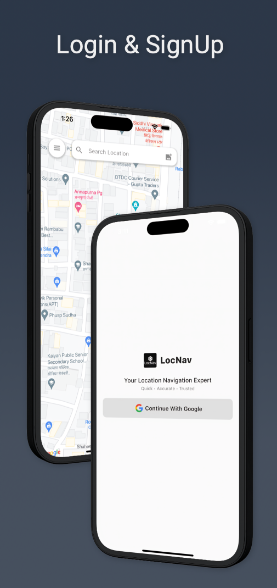
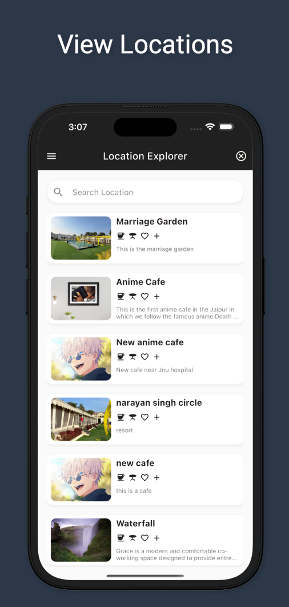
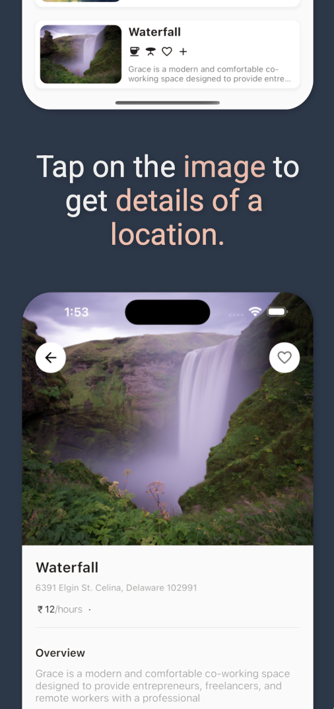
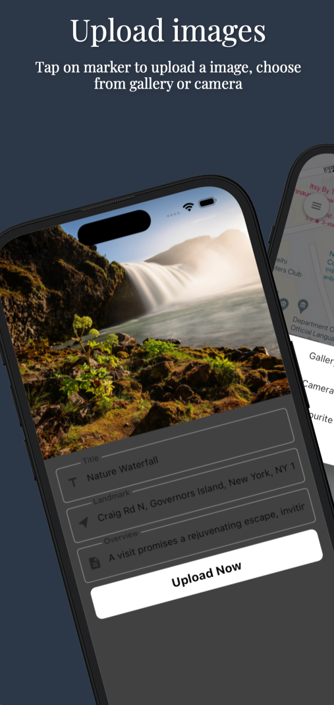
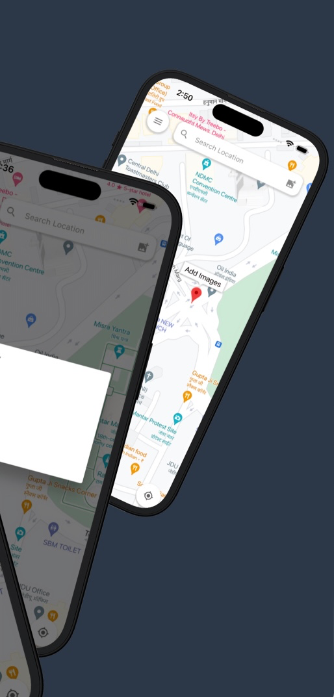
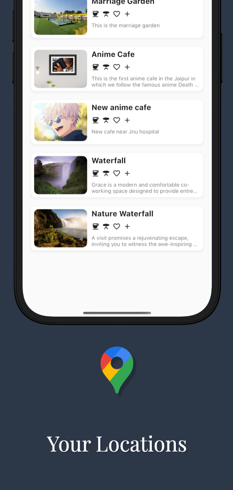
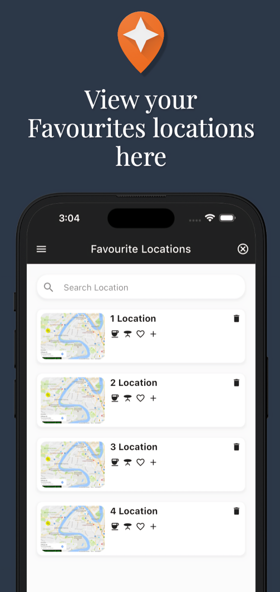

# LocNav

LocNav is a versatile and user-friendly Flutter application designed to enhance the user's experience in exploring and managing locations. Leveraging Geolocator and Firebase for real-time location services and backend support, this app seamlessly integrates API data, image capture, and location management in an engaging interface.

## LocNav APK Recording
- [Recording](https://drive.google.com/file/d/1_W2-OychFVbeO5pMK4UqaDbuYNKLXDXB/view?usp=share_link)

## Build and Run

- Ensure that you have Flutter and Dart installed on your development machine.

- Set up an IDE of your choice (such as Visual Studio Code or Android Studio) with Flutter and Dart plugins/extensions.

- Clone the "Location Explorer" repository from your version control system (e.g., Git).

- Open a terminal in the project directory.

- Run the following command to get the necessary dependencies:

```bash
  flutter pub get
```

Now follow these steps for Android:

### Android 

- Set up a Firebase project on the Firebase Console.

- Add your Android application to the Firebase project.

- Download and add the google-services.json files to the respective project directories.

- Set multiDexEnabled true in -app/build.gradle file.

- Connect an emulator or a physical device to your development machine.

- Run the following command to launch the app:
```bash
  flutter run
```

- Ensure that your Google Maps API key is configured correctly in the app.

- Check the Firebase authentication and database rules to match your app's requirements.

#### Now follow the steps given in the packages for android:-
 - [geolocator](https://pub.dev/packages/geolocator)
 - [imagepicker](https://pub.dev/packages/image_picker)
 - [geocodig](https://pub.dev/packages/geocoding)
 - [google_sign_in](https://pub.dev/packages/google_sign_in)

 ### iOS

 - Set up a Firebase project on the Firebase Console.

- Add your Ios application to the Firebase project.

- Download and add the GoogleService-Info.plist files to the respective project directories.

- Connect an emulator or a physical device to your development machine.

- Run the following command to launch the app:
```bash
  flutter run
```

- Ensure that your Google Maps API key is configured correctly in the app.

- Check the Firebase authentication and database rules to match your app's requirements.

#### Now follow the steps given in the packages for iOS:-
 - [geolocator](https://pub.dev/packages/geolocator)
 - [imagepicker](https://pub.dev/packages/image_picker)
 - [geocodig](https://pub.dev/packages/geocoding)
 - [google_sign_in](https://pub.dev/packages/google_sign_in)

## Key Features

API Integration
  - Utilizes Geolocator and Open Source Maps API for real-time location services.
  - Allows manual entry of the precise address for enhanced flexibility.
  
Image Capture
  - Enables users to take pictures of specific locations or upload images from their gallery.
  - Enhances the visual experience and personalization of each location.
    
Location List View
  - Presents a user-friendly list view of locations, each accompanied by its title and associated image.
  - Tapping on a location item navigates to a detailed view, providing a comprehensive overview.
    
Detailed Location View
  - Offers a detailed screen showcasing complete information about a selected location.
  - Displays title, image, and additional details for an immersive experience.
    
Navigation
  - Implements smooth navigation between the location list view and the detailed location view.
  - Enhances user experience by providing intuitive transitions.
    
Interactive Features
  - Empowers users to mark locations as favorites for quick access.
  - Supports location deletion, allowing users to manage their list effectively.
    
State Management
  - Efficiently manages the app's state using Flutter's Provider for optimal performance.
  - Ensures a seamless and responsive user interface.
    
Error Handling
  - Implements robust error handling to gracefully manage cases where the API is unavailable or returns errors.
  - Displays friendly error messages to guide users through unexpected situations.
    
UI/UX Design
  - Boasts an attractive and intuitive user interface, providing a visually appealing experience.
  - Prioritizes user experience with a clean and navigable design.
    
Firebase Implementation
  - Integrates Firebase for backend support, utilizing the Realtime Database.
  - Persists user data, allowing seamless access and interaction with locations upon subsequent logins.

## Packages Used
- __get: ^4.6.6:__. The ‘get’ package is used to handle the state management.

- __uuid: ^4.2.2:__  This package is used for creating unique session tokens.

- __http: ^1.1.0:__  This package is used for communication with external APIs, such as the Google Maps API for location data and - other services.

- __geocoding: ^2.1.1:__  The ‘geocoding’ package is used for converting between geographic coordinates (latitude, longitude) and human-readable addresses.

- __geolocator: ^10.1.0:__  This package provides geolocation services, allowing my app to retrieve the device's current location. It's crucial for fetching the user's real-time location and other location-related functionalities.

- __image_picker: ^1.0.7:__  This package enables my  app to access the device's camera or gallery for capturing or selecting images. In your app, it is used for allowing users to take pictures of locations or upload images from their gallery.

- __flutter toast: ^8.2.4:__  This package is used to display toast notifications in my app. Toasts are non-intrusive, temporary messages that provide feedback to users, such as success messages or error notifications.

- __flutter_lints: ^3.0.1:__ This package provides a set of lint rules for Dart and Flutter projects. It helps ensure code consistency, readability, and adherence to best practices.

- __firebase_auth: ^4.15.3:__  This package is part of the Firebase authentication services. It allows my app to implement user authentication, including sign-up, sign-in, and other authentication-related features.

- __firebase_core: ^2.24.2:__  This package is a dependency required for Firebase integration in Flutter applications. It initializes Firebase services and is necessary for using other Firebase plugins.

- __google_sign_in: ^6.1.5:__  This package facilitates Google Sign-In functionality in my app. It is likely used for allowing users to sign in with their Google accounts.

- __cloud_firestore: ^4.9.0:__  This package is part of Firebase and provides access to Cloud Firestore, a NoSQL document database. It allows my app to store and retrieve location data in real-time.

- __cupertino_icons: ^1.0.2:__  This package provides the Cupertino icon set for Flutter. It includes iOS-style icons, ensuring consistent visual elements across different platforms.

- __firebase_storage: ^11.5.6:__  This package is part of Firebase and allows my app to interact with Firebase Cloud Storage. It is likely used for storing and retrieving images or other media files associated with locations.

- __google_maps_flutter: ^2.5.3:__  This package enables the integration of Google Maps in my app. It is essential for displaying maps, markers, and other location-related features.

- __modal_progress_hud_nsn: ^0.4.0:__  This package provides a modal progress HUD (Heads-Up Display) that covers the screen to indicate loading or processing states. It enhances the user experience by providing visual feedback during background tasks.


## API Reference

#### Get google maps api

  - [Google Maps Api](https://developers.google.com/maps)

| Parameter | Type     | Description                |
| :-------- | :------- | :------------------------- |
| `api_key` | `string` | **Required**. Your API key |

#### Get item

Get the api_key to use the google maps.
## Additonal Links

- [APK link](https://drive.google.com/file/d/1f0pHL-Vvw7OLL2kb0XH11pGy9xtoXFuF/view?usp=share_link)

- [Screen recording with voice over of the app prototyping](https://drive.google.com/file/d/1_W2-OychFVbeO5pMK4UqaDbuYNKLXDXB/view?usp=share_link)

## Screenshots
| Login Page | Search Page |
| -------- | -------- |
|  |  |
|  |  |
|  |  |
|  |  |


